# 离散数学笔记(个人向)
___
参考资料：    
[1]: [离散数学复习笔记（已完结）](https://blog.csdn.net/qq_51594676/article/details/122138122 )    
[2]: [离散数学期末复习笔记【精华版】](https://blog.csdn.net/Sherlooock/article/details/115392090 )   
[3]: [离散数学笔记（期末复习用，持续更新…）](https://blog.csdn.net/Until_U/article/details/104774466 )   
[4]: [离散数学学习笔记 - chy_2003 - 博客园](https://www.cnblogs.com/chy-2003/p/11414534.html )   
[5]: [Markdown/LaTeX 数学公式和符号表](https://zhuanlan.zhihu.com/p/450465546 )
___
## 1.概述
- 离散数学分为四个主体部分：**数理逻辑**、**集合论**、**代数系统**以及**图论**。
  
## 2.数理逻辑
  
- 数理逻辑的演化
  1. 古典逻辑
      - 三段论:`大前提->小前提->结论`
  2. 现代逻辑  
  - 包含有：
    >               命题逻辑
    >               谓词逻辑
    >             公理化集合论
    >                递归论
    >                证明论
#### 1.命题逻辑
- `命题`是一个能判断真假的陈述句，其包含:**时间性、区域性、标准性** 
- `原子命题`是指**不能被分解成更简单命题的命题**
- 命题连接词有`否定，合取，析取，蕴含(条件)、等值`
  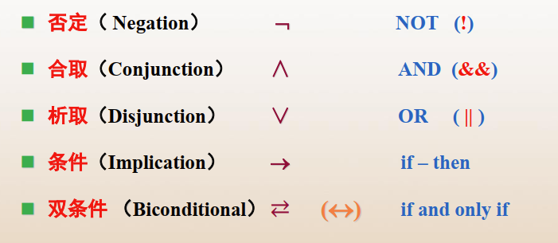
  其中可以简述为**或且非、所得、当且仅当**
- 以值`1为真，0为假`，会有以下结果关系：
  
- **[注意]**
  1. 对于`p->q`,**当且仅当p为真，q为假时，结果为假; 否则其他时候结果都应为真**。
  2. 对于`p<->q`来说，当且仅当`p`和`q`相同时，结果为真; 否则其余情况结果为假
  3. 运算优先级
   `非>且>或>所得>当且仅当`     
   或者     
   `否定 > 合取 > 析取 > 条件 > 双条件`
  4. 不可兼或
   - 又叫**与或**或者**相似**
   - 符号是,实际上是
   - 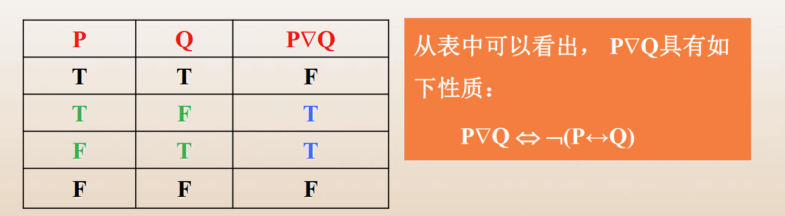
   - 它是与双条件相对的算符，输出的内容是**只要不相等结果就是真，相等结果就是假**
  5. *公式分类*
     1. 重言式
        又叫`永真公式`，赋值永远是真的式子
     2. 矛盾式
        又叫`永假公式`，赋值永远是假的式子
     3. `可满足式`
        既有真值又有假值的式子
     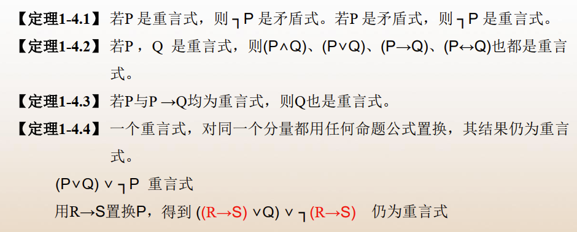
  6. 命题等价
    - 如果对两个公式Ａ,Ｂ不论作何种指派，它们的真值均相同，则称Ａ,Ｂ是逻辑等价的，亦说Ａ等价于Ｂ，记`A⇔B`.
    - **定理**
      `命题公式A⇔B的充要条件是A↔B为永真式。`
    - 常见的等价情况：
      1.     |`负负得正`
      2.    
        
      3. **结合律和交换律都成立**
      4.    
          |`交换律成立`
      5. **德·摩根律**
        
        |`取反开括号，括号内符号也要取反`
      6. **双条件等价式**
           |`当且仅当`
      7. 互斥律
        
        |`自己与自己的反面辩证统一`
      8. 吸收律
        
        |`这个可以用维恩图解释`
      9. **条件等价式**\*
        ****
  
      \* 上述内容构成`真值表`. 
  - 证明两个命题公式等价，可以利用`真值表进行等值演算`或者利用`等价代换(等价置换)`进行证明。
  7. 命题蕴含
  - **命题公式Ａ称为永真蕴含命题公式Ｂ，当且仅当Ａ→Ｂ是一个永真式**，记作：   
    \*注意  与  的区别
  - 蕴含表
    
  8. **条件否定**
    - 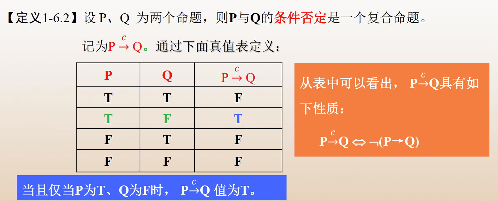
  9. **与非**
    - 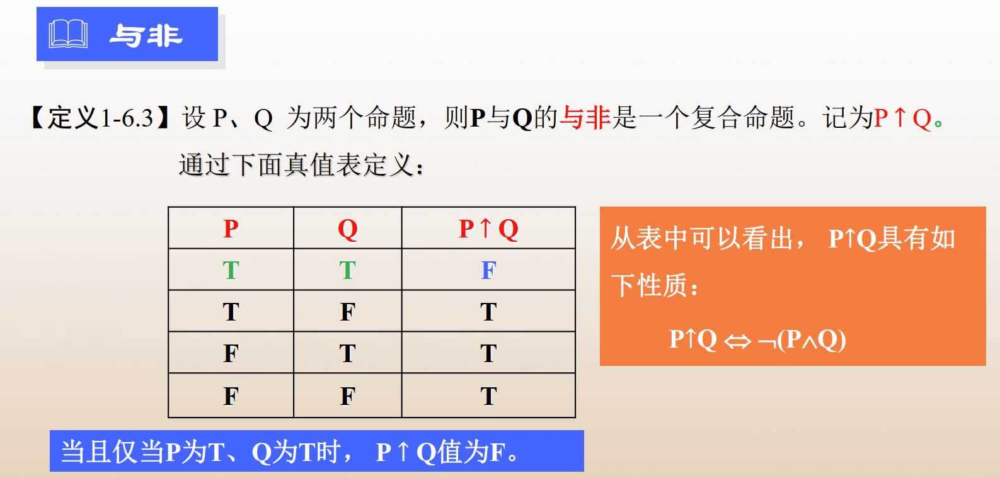  
  10. **或非**
    - 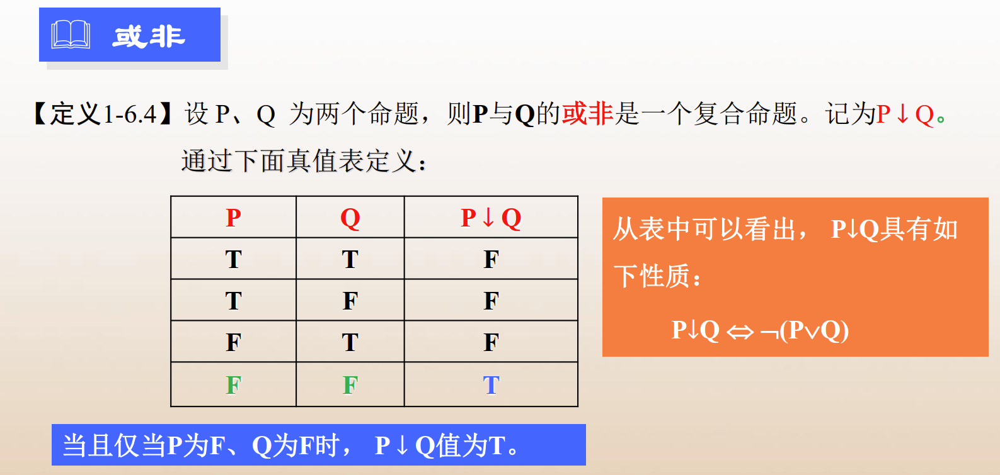  
  11. **对偶**
    - 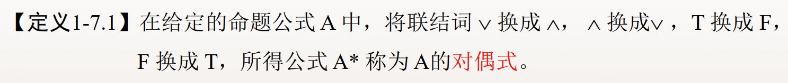  
    - 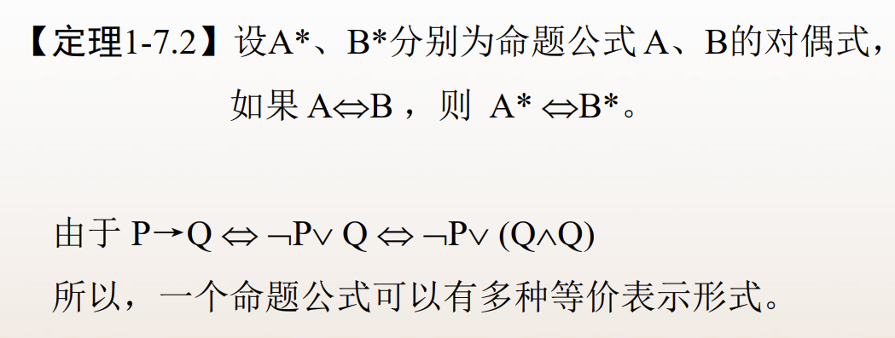
#### 2.范式
  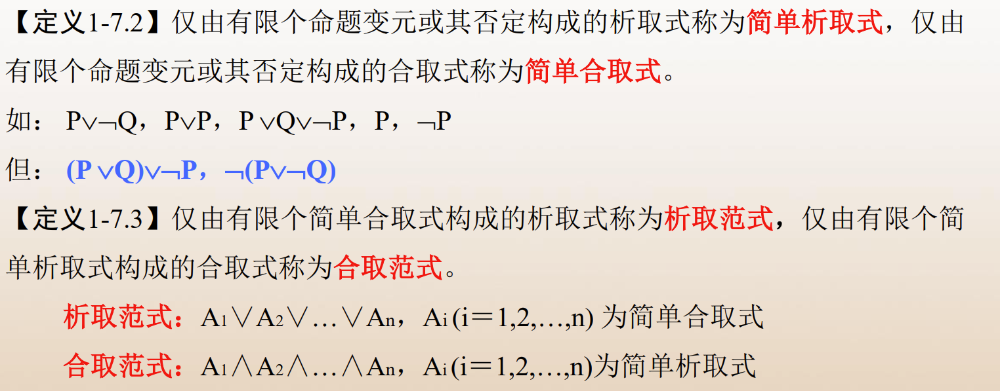
  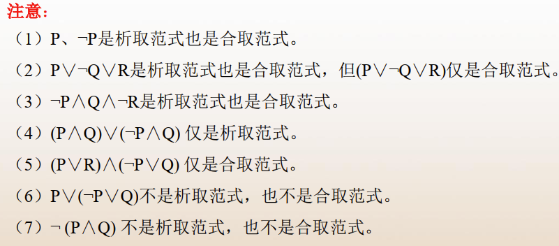
  - 命题变项及其否定统称为`文字`。
  - 由有限个简单合取式构成的析取式称为`析取范式`; 由有限个简单析取式构成的合取式称为`合取范式`。析取范式与合取范式统称为`范式`。
  - `简单合取式`又称小项，真值表中小项为“真”，**全体小项的析取式（即为主析取范式）为永真式。**    
  `简单析取式`又称大项，真值表中大项为“假”，**全体大项的合取式（即为主合取范式）为永假式。**
  - **定理**：`对于任意命题公式，都存在与其等值的析取范式和合取范式。`%给拆分命题提供了实证的支撑
  - **定理**：
    ```
    * 一个简单析取式是重言式当且仅当它同时含某个命题变项及它的否定式
    * 一个简单合取式是矛盾式当且仅当它同时含某个命题变项及它的否定式
    ```
  - **公式的析取范式与合取范式是不唯一的，公式的唯一的范式形式是主析取范式与主合取范式。**
  - 极项
    在含有个命题变项的简单合取式(简单析取式)中，**若每个命题变项和它的否定式不同时出现，而二者之一必出现且仅出现一次，且第个命题变项或它的否定式出现在从左算起的第位上**(若命题变项无角标,就按字典顺序排列)，称这样的简单合取式(简单析取式)为`极小项`(`极大项`)。
    由于每个命题变项在极小项中以原形或否定式形式出现且仅出现一次，因而个命题变项共可产生个不同的极小项。**每个极小项都有且仅有一个成真赋值**。若成真赋值所对应的二进制数转化为十进制数为，就将所对应极小项记作。
    类似地，个命题变项共可产生个不同的极大项，**每个极大项只有一个成假赋值**，将其对应的十进制数作极大项的角标，记作。
  - 关于极项，有以下结论：
    > \* 个极大项/极小项互不等值   
    > \* 假，其余极大项真;真，其余极小项假
    > \* **设和是命题变项形成的极小项和极大项，则会有以下转化关系:**
    > 
  - 若由个命题变项构成的析取范式(合取范式)中所有的简单合取式(简单析取式)都是极小项(极大项)，则称该析取范式(合取范式)为`主析取范式`(`主合取范式`)。
  
- 下面介绍求与给定公式等值的主析取范式和主合取范式的方法：    
  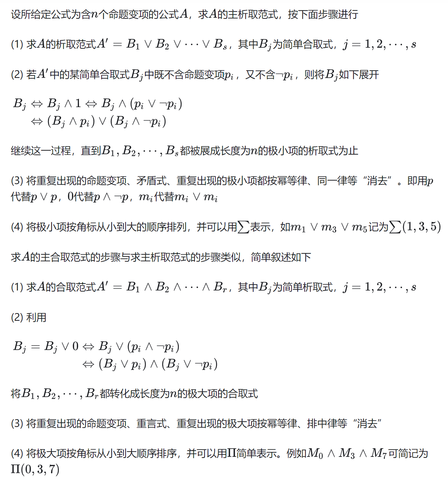
  **任何命题公式都存在与之等值的主析取范式和主合取范式，并且是唯一的**
- 范式有很多的应用,以主析取范式为例,它可以用于：
  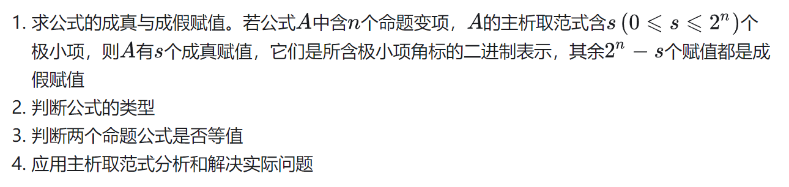
而主合取范式也是一样，可以通过将主析取范式与主合取范式互相转化的方法来实现：    
  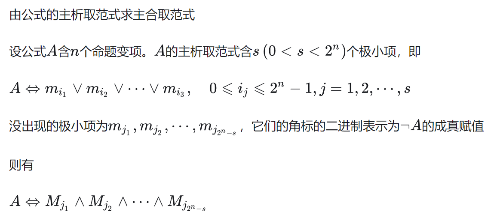
- **主析取范式中没有出现的极小项的下标恰好是主合取范式中极大项的下标**。于是，由公式的主析取范式，即可求出它的主合取范式。
  
#### 3.推理理论
- 验证推理有效性的方法：    
  ```
  真值表    %把情况一个个写出来
  命题推演
  ``` 
- 命题推演三要素：    
  ```
  推理依据
  推理规则
  推理方法
  ```
- 推理原则
  ```
  1. P原则(引入前提原则)
  在推导的任何步骤上，都可以引入前提。
  2. T 规则(引入结论规则)
  在推导过程中，如果前面有一个或多个命题公式永真蕴含命题公式 S，那么就可以把公式 S 也引入到推导过程之中。
  3. CP规则
  如果H1∧H2∧…∧Hn∧R => S,则H1∧H2∧…∧Hn => R→S
  ```
- 推理依据
  **主要指已知的逻辑等价式和逻辑蕴含式**
- 推理
  - > 1.方法
      **直接证法**
      **间接证法**(反证法和附加前提条件证法,形如)
      **分情况证明法**(形如)
    > 2.种类
        1）直接推理
        由一组前提，利用P规则，T规则直接推演得到有效结论的方法。
        2）条件论证(附加前提条件证法)
        如果要证明的结论是R→S形式，则可以把结论中R→S的前件R作为附加前提，与给定的前提一起推出后件S即可。
        3）反证法
        又叫`归谬法`
        要证明H1，H2，…，Hn=>C,只要证明 {H1，H2，…，Hn , ﹁C} 是不相容的即可
        解释：要证明H1，H2，…，Hn=>C,只要证明 H1∧H2∧…∧H3=>F 即可
        4）归纳证明法
        方便推理在计算机上的实现。归结证明法又称`消解法`。
        首先介绍**归结规则（归结定律）**    
        ****
        \*其中，是一个变元，和是简单析取式。   
        应用归结规则由两个含有相同变元(一个含变元，另一个含它的否定式)的简单析取式推出一个新的不含这个变元的简单析取式，对这个新的简单析取式又可以继续应用归结规则。
        **归结证明法的基本思想是采用归谬法，把结论的否定引人前提。如果推出空简单析取式，即推出，则证明推理正确。**
        具体步骤为：
        (1) 把结论的否定引人前提
        (2) 把所有前提，包括结论的否定在内，化成合取范式，并把得到的合取范式中的所有简单析取式作为前提
        (3) 应用归结规则进行推
        (4) **如果推出空简单析取式/推出0**(即化到最后只剩下形如的玩意)，**则证明推理正确**。
        \* 注意，在有的推理中，简单析取式只是一个文字，如。在运用`归结原理`时，将它们看作进行计算
  
  - 形式结构
    命题公式推出的推理**正确|有效**当且仅当
    > **蕴涵式为重言式**。   
    >
    以上为推理的`形式结构`，并记为
- 推理定理(背下来或者画韦恩图理解)
  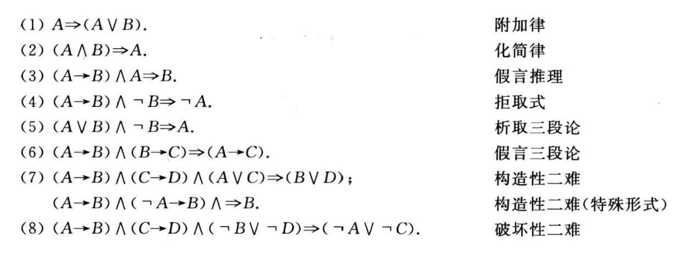
  可以把一个公式换成任何与它等值的公式，称作`等值置换`，简称`置换`。
- 推理证明
  设前提,结论。如果一个公式序列的最后是B并且序列中的每一个公式或者是某个,或者是前面公式的有效结论，则称这个序列是由前提推出结论的**证明**。
  
### 4.谓词逻辑
- 前提
  ```
  在研究命题逻辑中，原子命题是命题演算中最基本的单位，不再对原子命题进行分解，这样会产生两大缺点：
  （1）不能研究命题内部的结构，成分和内部逻辑的特征；
  （2）也不可能表达两个原子命题所具有的共同特征，甚至在命题逻辑中无法处理一些简单又常见的推理过程。
  ```
- 完备集
  称为**n元真值函数**。的自变量为个命题变项，值域为.
  **定理**：`每一个命题公式对应于一个真值函数，每一个真值函数对应于无数个命题公式。  `
  设是一个联结词集合(算符集)。如果任何元真值函数都可以由仅含中的联结词构成的公式表示，则称是**联结词完备集**。    
  以下的联结词集都是完备集：    
  
  
  
  
  
  
  
- 复合联结词
  即`与非`和`或非`两个关系算符。
  > 与非：
  > 或非：
  
  \*和都是联结词完备集。
  
- 谓语逻辑
  将`原子命题`分解成两部分：`名称`+`行为`，针对谓语分析的逻辑，被称为`谓语逻辑`。**谓语逻辑是命题逻辑的扩充和发展**。
  > 客观世界中可以独立存在的具体或抽象对象称为`个体`,即`名称`; 表示个体的词称为`个体词`。若个体词以常量的方式表示特定个体，则称之为`个体常量`；若个体词以变量的方式泛指不确定的个体，则称之为`个体变量`。
  > 表示个体（客体）特征、性质或关系的词，称为`谓词`,即`行为`。
  
以下为相关性质:
1. **谓词与个体常量一起可以表示一个命题**;但如果对于一个含有个体变量的谓语函数，由一个谓词和一些个体变元组成的表达式，称为`简单谓词函数`。如果一个函数包含n个个体变元，则称为`n元简单谓词函数`。由简单谓词函数和命题连结词组成的表达式，称为`复合谓词函数`。**谓词函数不是命题，只有当所有的个体变元都用确定的个体代入时，才表示一个命题**。对于一个谓词函数，每个个体变元都有其取值范围，该取值范围，称为是该个体变元的`个体域`（`论域`）
  
2. 量词
   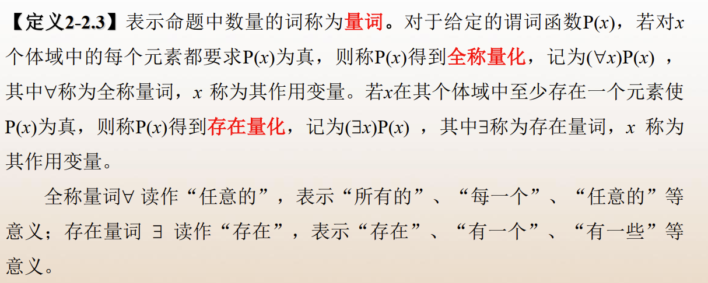
   1. 全称量词
      ""的几种表示方法:
      : 对所有的，是情况
      :  对所有，不是的情况
      :  并不是对于所有的，是的情况
      : 不存在一个，使不是的情况
   2. 存在量词
      ""的几种表示用法：
      : 存在一个，使是的情况
      : 存在一个，使不是的情况
      :  不存在一个，使得是的情况
      : 不存在一个，使不是的情况
  
    例如：
    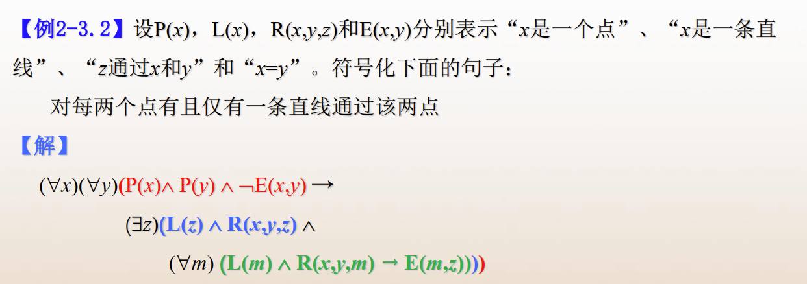
    \***要明确书写规范，先用括号()括住说明对象，再于其后用括号()括住行为事件**(专用名词是`谓语公式`)
3. 变元
   1. 辖域
      紧接在量词后面括号内的谓语公式    
      > 如中的
  
   2. 约束变元
      **在量词的辖域内，且与量词下标相同的变元。**
   3. 自由变元
      当且仅当不受量词的约束。
4. 范式转化
   对于一个公式，如果量词均在全式的开头，它们的作用域延伸到整个公式的末尾，则该公式叫做`前束范式`。
   如何对复杂的命题，将其相近的量词变量合并，考察我们对命题转化的理解。
   1. **谓词演算的等价式与蕴含式**
      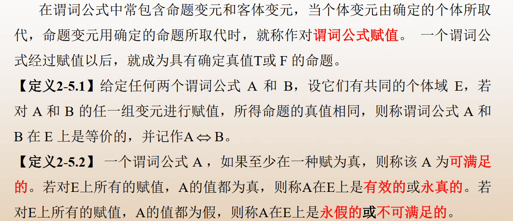
  
   2. **辖域转化**
      根据谓语公式等价的定义，当个体域，可以得出：
      1.   `%任意是交`
      2.  `%存在是并`
      3. **定理**：**提出来或提进去会使范围符号变号**
          
          
      4. 分配律
        `%析取全`
        `%合取并`
      5. 半分配律
        
        
        `%背下来，画韦恩图理解，思路是大包小，大可能包小可能`
      6. 关系扩张
        
        
        `%任意的对象支持关系的分配扩张`
      7. 量词作用域的扩张和拓展
        **一类**："" 和""
         
         
         
         
         **二类**：""**注意符号变化**
         
         `%变号了`
         
         `%没变号`
         **定理**：打开谓语公式进行辖域分配时，若变量出现在推导符的左边，则打开后改变符号;若出现在推导符的右边时，则不用改变符号
         > 推导过程
         > 
         > 
         
         > 其余也是同理，而不变号是由于与辖域内的变量不一致，不受影响
  
         **在谓词演算中，由于在前提和结论中的谓词公式常带有量词，因而要使用命题演算的等价式和蕴含式需要消去和添加量词。**
  
    3. 谓词演算的推理推论
        > 命题推理的基本元素 推理规则：P规则、T规则、CP规则
        > 推理方法：真值表法、直接证法、间接证法
        > 推理依据：等价式、蕴含式
    4. 谓语演算的推理规则
        > 指定：区域推个体  
          推广：个体推区域
  
        **全称指定(`US`)**
               
            `%c代表个体域中的任意元素`      
        **存在指定(`ES`)**    
                
            `% 1.c代表个体域中的部分元素`   
            `% 2.在每次使用时都要引入不同的个体,例如x就是一种个体`
        **全称推广(`UG`)**
               
            `%c要能够代表个体域中的所有元素`
        **存在推广(`EG`)**    
                
            `%显然易见`
  
      例如：
          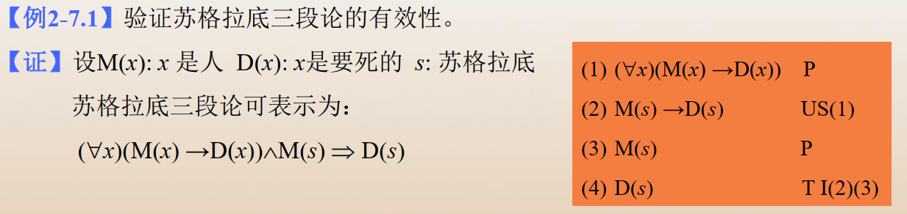
          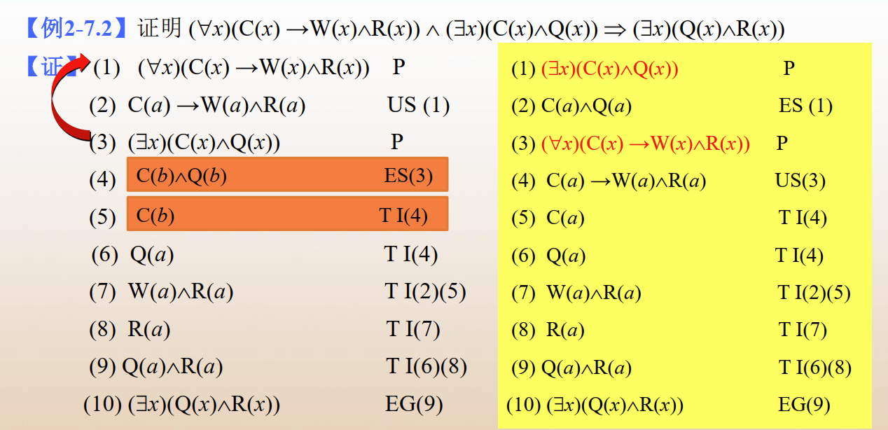    
          `%老老实实把推导符左边和右边的式子分别都按照规律一步一步的推导出来，一相比对，若相同则推导成功`  
  
## 3.集合论
#### 1.基本概念
  - `集合`是**包含不同对象的一个无序的聚集**。
  - 集合元素在集合里面叫做`包含`，例如包含，记作
  - 描述集合有以下几种方法：    
    `列举法`、`集合构造法`、`叙述法`    
    > 上述方法在计算机科学中处于奠基地位,对于循环遍历使用颇多
  - 当两个集合拥有全部相同的元素，则称两个集合`相等`，写作
  - 特殊集合
    1. 空集    
        >  是任何集合的子集
    2. 幂集 
        > 幂集是  的所有子集的集合
    3. 全集 或
        > 在一个**相对固定的范围内**，包含此范围所有元素的集合，称为`全集`
  
#### 2.集合的运算   
  - 并()
    1.   `%幂等律`
    2.   `%交换律`
    3.  `%结合律`
    4.  `%同一律`
    5.  `%零律`
  - 交()
    1.   `%幂等律`
    2.   `%交换律`
    3.  `%结合律`
    4.  `%同一律`
    5.  `%零律`
   - 补()
      设为全集，则称为关于的`补集`，记作    
      > 
   - 差/相对补()   
      设为任意两个集合，称为与的`差集`或者`B相对于A的补集`,定义为：   
      >  
   - 子集个数
     **定理**：若,即集合有个元素，则的子集个数为,或记作
   - 分配律&吸收律
      1. 
      2.  `%分配律`
      3. 
      4.  `%吸收律`
   - 其余内容(较重要)
      1.  `%双重否定律`
      2.  `%排中律`
      3.  `%矛盾律`
      4. > 
         >  
         > **德摩根律**在集合中的应用，**取补的过程等同于命题的取反**或者矩阵的取逆
      5. 
         
      6. > 
  
      7. 
      8. > 
      9. 
   - 对称差(或)
     定义：
     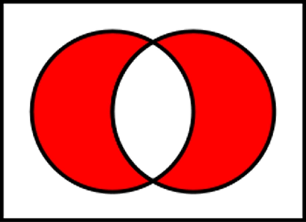
     性质：
     1. 
     2. 
     3. 
     4.  `%自己和自己怎们会有剩`
     5. 
     6.  `%分配律仍成立`    
     7. > 若，则 %背下来
   - **容斥原理**
     > 极其非常重要，总结就是**奇数个集合加，偶数个集合减**，有点像   
  
     设和是任意有限集合，则会有:
     1. <p align="center"></p>  
 `%二维的情况`
     2. <p align="center"></p>  
`%n个集合的情况`
      
      **定理**：将集合概念带入概率空间, 则可以在概率论中也适用`容斥原理`,写作：
          <p align="center"></p>  
  
     3. <p align="center"></p>  
`%德摩根律的应用`
  - **序偶与笛卡尔积**
    - 序偶    
      **有序**二元组的称呼，可以看作一个有顺序的集合，相当于`键值对`，记作。
      其中\*
    - 笛卡尔积
      - 若与是集合，那么与的笛卡尔积相当于,表示为<p align="center"></p>  
  
      - 除此之外，规定
      - **笛卡尔积支持分配律和交换律**
      - 个集合的笛卡尔积
        <p align="center"></p>  
  
      - **定理**:设是四个非空集合，则当且仅当
#### 3.关系
  - 一个到的`二元关系`就是的子集
  - **关系具有互斥性**。对于一个笛卡尔积，里面的任意一个序偶只能属于或者不属于关系，记作：
   或者 
  - 几个域名
    1. **前域**: 在二元关系中所有键值对的键值，记作:   
    <p align="center"></p>  
  
    2. **值域**: 在二元关系中所有键值对的值,记作:   
    <p align="center"></p>  
  
    3. **域**: 前域和值域的**并集**，泛指与关系有联系的数的范围。记作：    
    <p align="center"></p>  
  
  - 关系矩阵
    对于两个有限集合和, 是从到上的一个二元关系，那么则有相应的关系矩阵: <p align="center"></p>  
  
  - 性质:
    1. > 简而言之为**自反**、**对称**、**传递**三大性质。
       1. 1. **自反**关系
      <p align="center"></p>  
  
       2. 反自反关系
      自反的修正，不可能出现则为反自反
       3. **对称**关系
      对于关系, ,每当，就有成立。
       4. 反对称关系
      即对称的反面:   
       <p align="center"></p>  
  
       5. **传递**关系
       对于, 若， 则成立
    2. 性质在**关系矩阵**(`邻接矩阵`)上的体现：   
       1. 自反：对角线元素全是1   
       2. 对称：对称矩阵
       3. 传递：结合数据结构理解，或者是**允许间接寻址**
    3. 性质在**关系图**(`邻接表`\图示)上的体现：   
       1. 自反：关系图中每个结点均有自回路
       2. 对称：关系图中若两个结点之间有有向弧，则必成对出现
       3. 传递：可以路线规划，挨个遍历结点  
  - 复合关系
    > 是到的关系，是到的关系，则和的复合关系称为和的`复合关系`.
  
    *复合关系即考验元素在关系间是否具有传递性。*
  - **逆关系**
    是到的二元关系，将所有序偶的元素次序颠倒，得到的关系就是的`逆关系`，记作 
  - 闭包运算
    例如以下实例：    
    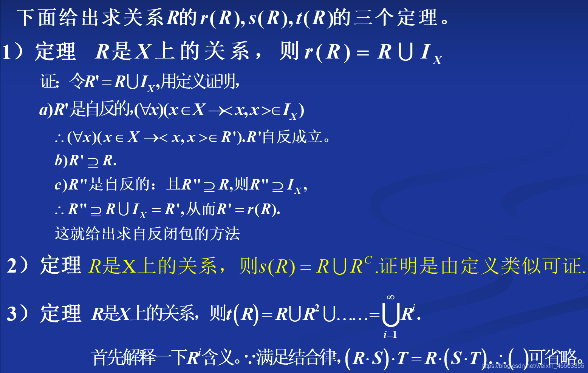
    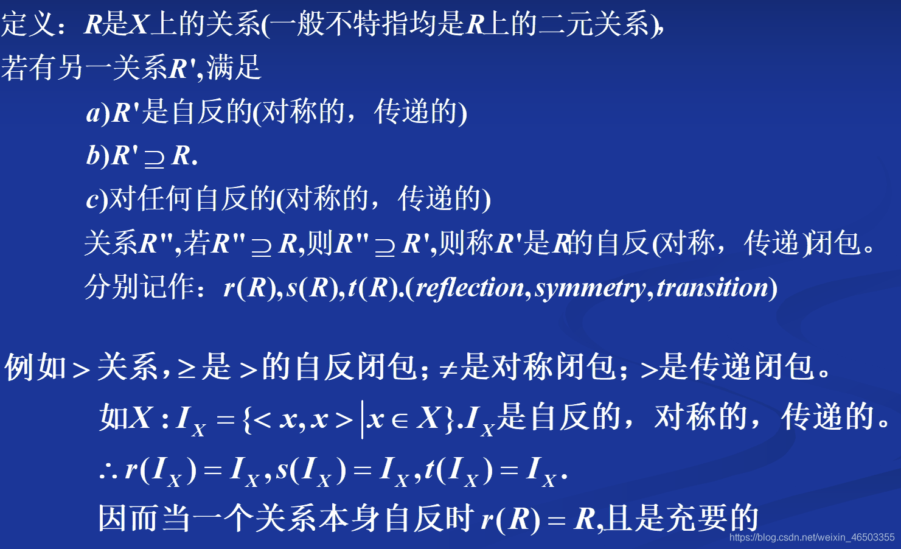
    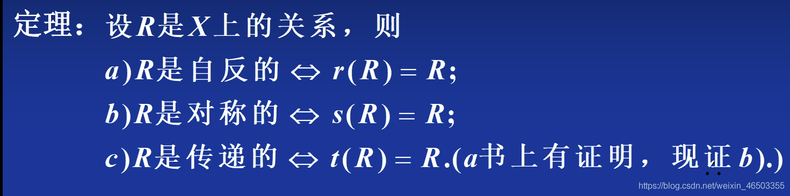
  - 集合的划分
    1. 覆盖
      > 设是一个非空集合，,当    
      > (1) 
      > (2) 
      > 则称是的 `覆盖`
    2. 划分
      > 设是的一个覆盖，且<p align="center"></p>  
,则称每个均为这个划分的一个划分
    **划分一定是覆盖，但覆盖不一定是划分**\*
#### 4.等价\轨道
1. 等价类
   > 是上的等价关系，对于,称集合为由  生成的  等价类，写作：   
   <p align="center"></p>  
  
   或可写作：   
   <p align="center"></p>  
  
   简称为`x的等价类`，简单写作：    
   <p align="center"></p>  
  
  
   关于等价类有以下的性质：   
   1. 等价类是一个集合，且
   2. **中的元素是在等价关系中，与有等价关系的所有元素组成的集合**。
   3. 
   4. 
   5. **一种等价关系是对集合的一种划分**，一个元素必将属于且只能属于一个等价类
   6.  当且仅当 
   7.  当且仅当 
   8. **所有等价类的并是原集合**
2. 商集
   - 商集是一类特殊的等价类\划分
   - 定义：
     > 是上的等价关系，由的所有等价类构成的集合
     <p align="center"></p>  
  
     ，被称为关于的`商集`，记作
  
     例如:    
     为全体自然数，R为两倍关系，例如 而 ,则为所有自然偶数
   - 
3. 相容关系
   1. 定义
    > 对于上的关系，若是**自反**的、**对称**的，则称是`相容关系`。
   2. **相容类**
     > 设是集合上的相容关系，若,如果对于中任意两个元素  有  ,则称是由相容关系产生的`相容类`。
4. 序关系
    1. 偏序关系
      **是偏序即意味着有排序**
      - > 对于上的关系，若是**自反**的、**反对称**的、**传递**的，则成是的一个`偏序关系`，记为
      - 设为偏序关系，<p align="center"></p>  
  
      - 序偶被称为`偏序集`
      - **覆盖**
        在偏序集中，设为非空集合上的偏序关系，。<p align="center"></p>  
  
    2. 链与反链
       - 在偏序集合中，对于的一个子集，如果每两个元素都是有关系的，则称该子集为`链`(chain)
       - 反之，若的子集中每两个元素都是无关系\找不到关系的，则称该子集是`反链`。
    3. 全序关系
       - 在偏序集中，**若是一个链**，则称为`全序集合`或者`线序集合`。
    4. 哈斯图
       - `哈斯图`是对序关系关系图的一种简化画法,参照[偏序表示中用的哈斯图（hasse diagram）是什么？](https://www.zhihu.com/question/39930682 "来自知乎")
       - 
       - 具体画法参见[哈斯图的画法介绍](https://zhuanlan.zhihu.com/p/618016174 "来自知乎帖子")或者[哈斯图的画法，以及利用哈斯图寻找极大元之类](https://zhuanlan.zhihu.com/p/27205924 "来自知乎")
       - 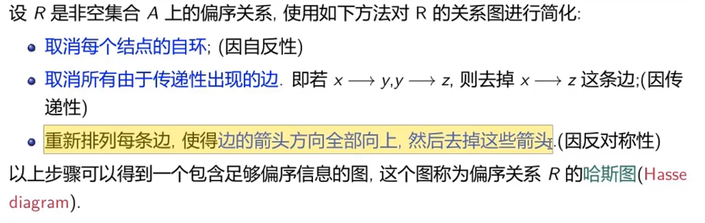       
       > 偏序集的Hasse图的作法如下：
          1. 用小圆圈(或小圆点)表示集合A中的元素;
          2. 如果a≤b,且a≠b,则将代表a的小圆圈画在代表b的小圆圈的下方。
          3. 只有当a是b的直接前辈(后裔)时，才将代表a的小圆圈和代表b的小圆圈用直线连接。
       - **哈斯图的应用**  
         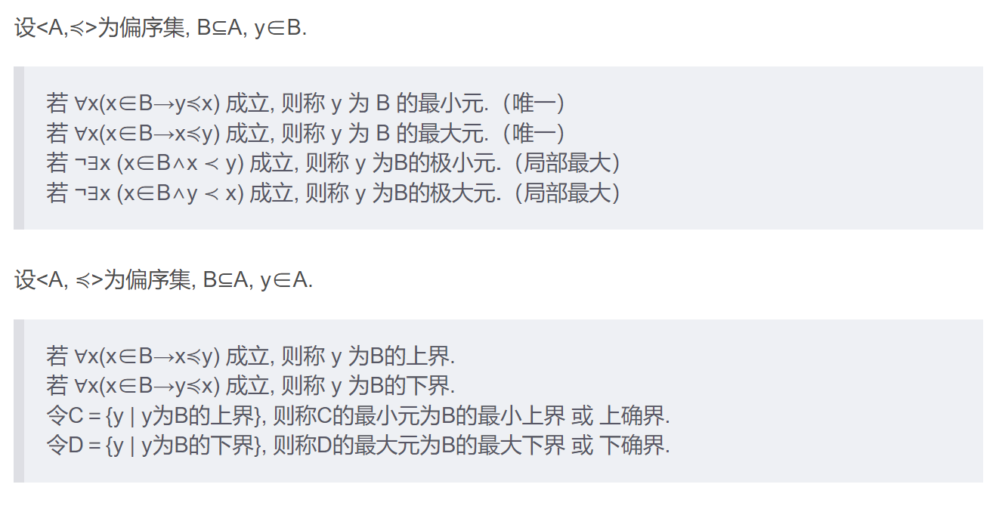
  
  #### 5.函数
   - 定义
      设为二元关系，若任意都存在唯一的, 使得成立，则称为`函数`。对于函数，如果有存在，则记为，并称为在的值
   - 特征
     1. 的前域就是函数的`定义域`，记作 。
     2. 的`值域`为且满足 , 称集合是的`共域`
   - 特殊映射
     1. 满射
        > 若,则称映射为`满射`或`上映射`
     2. 单射
        > 不同的对应不同的不会出现重复映射的情况。
     3. 双射
        > 若映射**即是满射，又是入射**,则称这个映射是`双射`的    
  
   - 复合函数
     > 设是函数，则称是`复合函数`。
     > 它满足：
       (1) 
       (2) 任意, 有
   - 反函数
      > 设，且为双射，当存在且为**双射**
      时，称有`反函数`,也就是。
   - **特征函数**
      > 1. ,  ，称用1代表在集合内，0代表不在集合内的特殊函数叫`特征函数`。
      > 2. 当  时， 为满射。
  - 集合规模
    - 势
      1. **等势定义** 
        > 设,是集合，如果存在着从到的双射函数(单射+满射)，则称和是`等势`的。,记作。
      2. **双射定义**
        > 给定两个集合和，两个集合的元素**一一对应**，则，等势，记作(双射)
      3. 常见集合的势
          1. 
          2. **任何实数区间都与实数集合等势**
    - 基数
      > 所有与集合  **等势**的集合所组成的集合，叫做集合的集合`基数`，记作。
    - 可数
      1. > 与**自然数**集合等势的任意集合被称为`可数的`。
      2. 有限集 + 可数集 = **至多可数集**
      3. **定理**：可数集和任何无限子集是可数的。
      4. 任意无限集，必含可数子集   
         任意无限集，必与某一真子集等势`%无限与无限在一定规则下可以达成一一对应`
    - **定理**：若集合到存在一个入射，则势不大于势，即
  
## 4.代数系统
  - 详细见于我的另外一条笔记《近世代数笔记(个人向)》，此处略
  
## 5.图论
#### 1.图
1. 定义
   > 一个图是一个**三元组**,其中是一个非空的**结点集合**，是**边集合**，是到结点序偶的函数。
   1. 一个结点的`度数`，即连接该节点的边的数目，用表示。若边有方向，则都可以分成**出度**、**入度**
   2. 仅由孤立结点组成的图称为`零图`
   3. 仅由一个一个孤立结点构成的图称为`平凡图`
   4. 结点个数记为
   5. 含有平行边的图称为`多重图`
   6. 不含由平行边和自环的图称为`简单图`
   7. 由个结点的无向完全图记作
   8. 个结点的无向完全图的边数为
   9. 如果且，则称是的`子图`，记作
   10. 若是的子图且(结点情况相同)，则称和的`生成子图`。
   11. 对于的度数，是的`最大度`；是的`最小度`
   12. 若无向图为连通图，图的结点集有点集，使得中删除了的所有结点以后，所得的图不再是连通图，但删除的任何真子集后，所得的图仍是连通图，则可称为`点割集`。当一个点构成点割集时，则称这个点是`割点`(**使得体系能够连通的最关键的点**)
   13. 设无向图为连通图，若边集是的子集，使得中删除了的所有边以后，所得的图不是连通图但删除了的任何真子集后，所得的图仍是连通图，则称为`边割集`。若一条边构成边割集，则称这条边是`割边`或者`桥` 
  
2. 性质
   1. **每个图中，结点度数的总和等于边数的两倍**
   <p align="center"></p>  
  
   2. **在任何图中，度数为奇数的结点必然是偶数个**
   3. 在有向图中,从顶点v0到顶点vn的一条路径是图中的边的序列,其中每一条边的终点是下一条边的起点。
3. 路径与回路
   > 1. 一条路径中，如果同一条**边**不出现两次，则称此路径是`简单路径`
   > 2. 一条路径中，如果同一**顶点**不出现两次，则称此路径是`基本路径`(或叫`链`)
   > 3. 如果路径的**始点和终点相重合**，即，则此路径称为`回路`
   > 4. 没有相同边的回路称为`简单回路`; 通过各顶点不超过一次的回路称为`基本回路`。
   > 5. 路径中所含的边的条数称为路径的`长度`
4. **连通**
   - 在无向图中，若结点和结点之前存在一条路，则称和是`连通`的
   - **连通性是结点集的等价关系**。通过连通性，我们可以对这个图做出一个划分，把分成非空子集。**使得两个结点和是连通的当且仅当它们同属一个**。
   - 连通度`k(G)`
     > 记<p align="center"></p>  
作为图的点连通度(`连通度`)
  
     - **连通度数值上等于点割集元素个数，表示为了产生一个不连通图所需要删去的点的最少数目**
     - 完全图中，若  且删去  个结点，会产生一个平凡图。
   - 我们把子图称作的`连结分支`(不同划分)，把的`连通分支数目`记作。
   - 连通图(两种解释)
     > 1. 若图只有一个连通分支，则是`连通图`
     > 2. 如果图中任意一对顶点都是连通的，则称此图是连通图(**也就是只有一种轨道**),否则称是非连通图。
   - **边连通量**
     > <p align="center"></p>  
  
  
     - 它在数值上等同于边割集的元素数目，表示**为了产生一个不连通图需要删去的边最少数目**
     - 对于一个不平凡图可以定义,此外一个不连通图也有。
   - **定理**：   
     > 对于任何一个图，都有:<p align="center"></p>  
  
   - 一个连通无向图中，结点是割点的**充要条件**是： 
      > 存在两个结点和，使得和的每一条路都通过
5. 强连通性和弱连通性
   - 一个有向图，将有向图的所有的有向边替换为无向边，所得到的图称为原图的`基图`
   - **如果一个有向图的基图是连通图，则有向图是`弱连通的`，否则称为`非连通的`.**
   - 若中任意两点都有从可达，或从可达,则称是`单向连通`或者`单侧连通`的;
   - 若中**每点均可达其他任一点**,则称是`强连通的`。
   - **定理**：一个有向图是`强连通`的，当且仅当G中有一个**回路**，它**至少包含每个结点一次**。
   - 在简单有向图中，具有强连通性的最大图，称为`强分图`。
   - 具有单侧连通性的最大子图，称为`单侧分图`。
   - 具有弱连通性的**最大子图**，称为`弱分图`.
6. 图的矩阵表示
   1. 邻接表示
        - 即是在数据结构中学到的**邻接表**和**邻接矩阵**，主要介绍邻接矩阵.
        > 对于邻接矩阵来说:
        > 当时，
        > 当时，
        > 在无向图中， ; 而在有向图中，。
        - **定理**：设是图的邻接矩阵，则  中的行，列元素 等于G中联结和的长度为l的路的数目
        - 若图的边无权重则无值域仅为; 反之若有权重则不一定为
        - 对两个结点路径的探究应用面很广，例如`马尔科夫链`。找出最短路径有`Dijkstra算法`和`Floyd算法`；找出最短生成树(`MST`)的算法有`Prim算法`和`Kruskai算法`。以上详细见[数据结构——图的应用算法详解](https://blog.csdn.net/pary__for/article/details/109048689 "来自CSDN")
   2. 可达性矩阵
      > 当至少存在一条路到达时，
      > 当不存在一条路到达时或  时，
   3. 完全关联矩阵&关联矩阵
      1. 关联矩阵
         关联矩阵是由的结点和的边集构成。
         > 当关联时，
         > 当不关联时，
  
          其具有相关性质如下：
           1. 图中每一边关联两个结点，故的每一列只有两个1.
           2. **每一行元素的和数是对应结点的度数。**
           3. 一行中元素全为0，其对应的结点为孤立节点。
           4. 两个平行边其对应的两列相同。
           5. 同一个图当结点或边的编序不同时，其对应的仅有行序和列序的不同。
  
      2. 完全关联矩阵(`有向图`)
        关联矩阵是由的结点 和的边集构成的。
        > 当是边的起点时，
        > 当是边的终点时，
        > 当不关联时， 
  
        **定理**：
        如果一个连通图  有  个结点，则其完全关联矩阵  的秩为  ，即<p align="center"></p>  
  
  7. 特殊的图
     1. **欧拉图**
        - 参见`哥尼斯堡七桥问题`
        - 给定无孤立节点图  ，若存在一条路，经过图中每边**有且仅有1次**，该条路称为`欧拉路`。
        - 若存在一条回路，经过图中每条边一次且仅一次，则称为回路为`欧拉回路`。
        - 具有欧拉回路的图也称作`欧拉路`。
        - **一笔画定理**：   
         > 无向图  具有一条欧拉路，当且仅当  是连通的，且有**零个或两个奇数度结点**。
        - 若对于有向图来说：   
          - 给定有向图  ，通过图中每边**有且仅有一次**的一条单向路(回路)，称作`单向欧拉路`(`回路`)。
          - **一笔画定理**
             > 有向图  具有一条单向欧拉回路，**当且仅当是连通的，且每个结点入度等于出度**[1]。   
             > 一个有向图  具有单向欧拉路，**当且仅当它是连通的，而且除两个结点外，每个结点的入度等于出度，但这两个结点中，一个结点的入度比出度大1，另一个结点的入度比出度小1**[2]。
     2. 汉密尔顿图
        - 给定图  ，若存在一条路经过图中的每个结点恰好一次，这条路称作`汉密尔顿路`。
        - 若存在一条回路，经过图中的每个结点恰好一次，这条回路称作`汉密尔顿回路`。
        - 具有`汉密尔顿回路`的图称作`汉密尔顿图`。
        - 若图  具有汉密尔顿回路，则对于结点集  的每个非空子集  均有 <p align="center"></p>  
 成立。其中  是  (**去掉的剩余部分**)中连通分支数。
        - *汉密尔顿图的判定*
          - 虽然汉密尔顿回路问题与欧拉回路问题在形式上极为相似，但对图G是否存在汉密尔顿回路还**无充要的判别准则**。 
          - 下面是一个有  个结点的无向图具有汉密尔顿路的**充分条件**：    
              1. 若  中每一对结点度数之和大于等于  ，则  中存在一条汉密尔顿路。    
              2. 若  中每一对结点度数之和大于等于  ，则  中存在一条汉密尔顿回路。
  
  